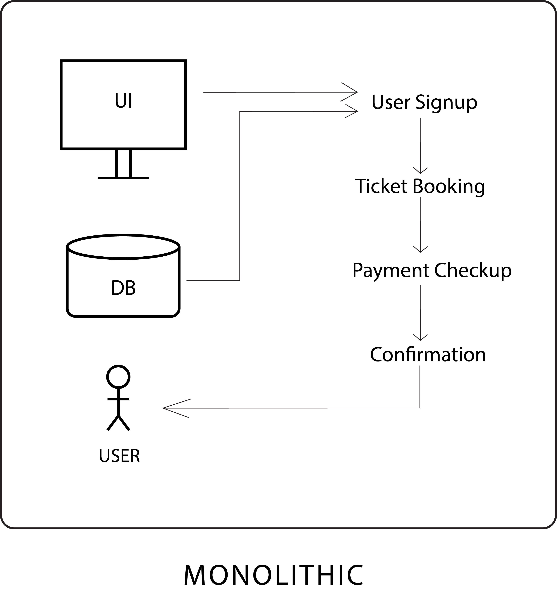
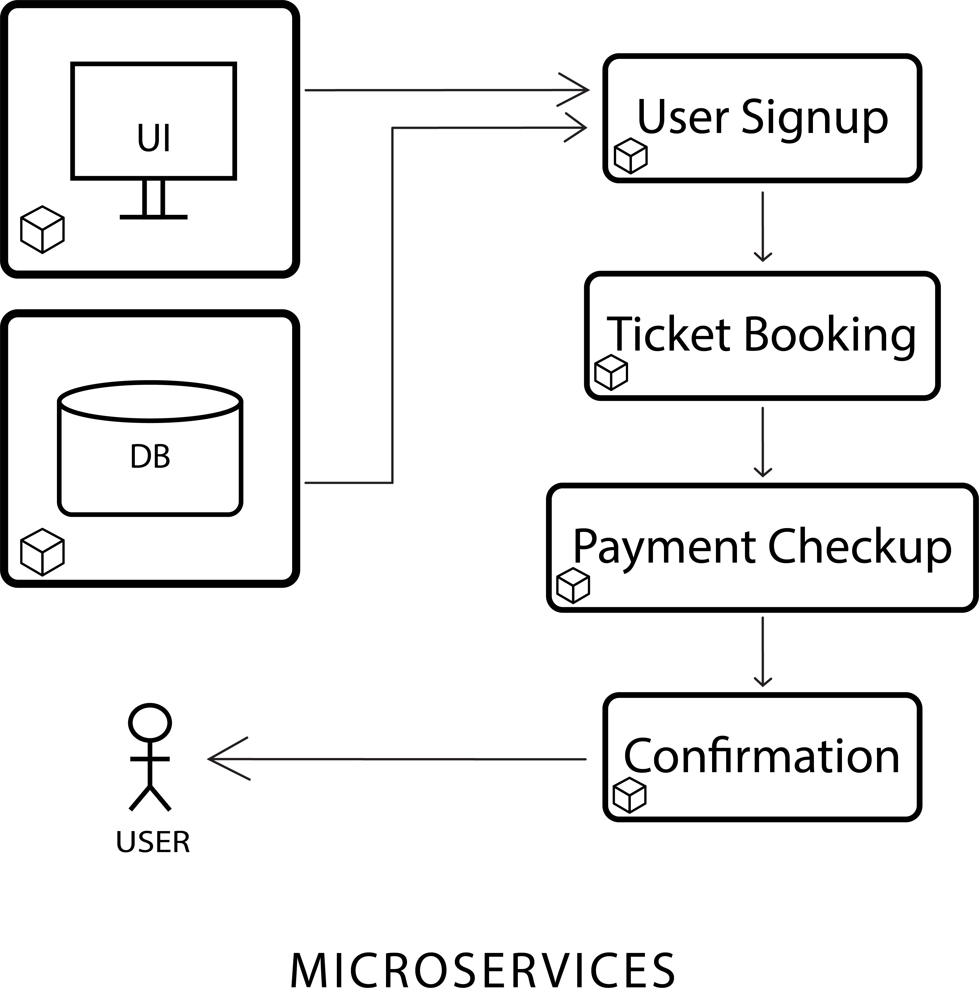

<h2 align=middle>KUBERNETES (K8s)</h2>

<h4>BASIC LINUX COMMANDS FOR KUBERNETES</h4>

    ls : list information about the files
    mkdir : creating new directory
    cd : changin the directory
    touch : create an empty file
    vi : text editor
    vim : text editor
    cat : reading files sequentially
    cp : copy command
    mv : move command
    chmod : changing file permissions [400 -> read only]
    kill : killing the process
    env : getting the list of enviornment variables
    export : exporting the variables
    curl : transfer data from or to a server
    tar : archive utility
    du : disk usage command [du -h -> readable / du -sh -> summary]
    ping : network connectivity
    netstat : network statistics to monitor network connections
    nslookup : name server lookup
    ps : process status
    tail : print last N lines of a file
    systemctl : to control services
    journatctl : vie system logs
    top : memory and cpu utilisation view
    clear : to clear the screen
    .. : to switch to the previous directory
 

<h4>MONOLITHIC vs MICROSERVICES</h4>

<ul>
    <li>ARCHITECTURE : Monolithic architecture all components are tightly covered, all the communication are internally systems. 
    Microservices architecture all components are seperate, and the communication happens via external interfaces, these are seperate APIs that are communicate over network.</li>
    <li>LATENCY : Minimal latency in monolithic application. 
    Minimal latency is greater that monolithic application in microservices application.</li>
    <li>LANGUAGE : For monolithic application we have to code in single programming language. 
    In microservices application, we get flexibility to code each of the components in different languages.
    <li>SCALING : Monolithic application are difficult to scale. 
    In Microservices application, we can scale individual components.</li>
    <li>DEPLOYMENT : Monolithic application take more time to deply and it not a failed fast model. 
    In Microservices application, we can deploy individual components on a daily basis.</li>
</ul>

For Microservices, we have full control over each of the components and that can be containerized as well as running on powerfull ecosystems like Kubernetes.

 
<h4>INTRODUCTIONS TO CONTAINERS</h4>

A standard container that is loaded with virtually any goods, and stay sealed until it reaches final delivery. 
    In between, can be loaded and unloaded, stacked, transported efficiently over long distances, and transferred from one mode of transport to another.

An engine that enables any payload to be encapsulated as a lightweight, portable, self-sufficient container that can be manipulated using standard operations and run hardware platform.

<h4>CONTAINERS vs VIRTUAL MACHINES</h4>

 
<h4>Worker machines in K8s clusters (Worker Nodes)</h4>
3 node processes :
<ol>
    <li> Kubelet : It interacts with container and node.</li>
    <li> Kubeproxy : Forwards the request.</li>
    <li> Container runtime : (eg: docker, etc.)</li>
</ol>

<h4>Master Nodes / Servers</h4>
4 processes runs on every master node.
<ol>
    <li>API Server : Cluster gateway which gets the initial request for update the cluster or query from the cluster, also acts as a gatekeeper for authentication.</li>
    <li>Schedular : It just decides on which node new pod should be scheduled.</li>
    <li>Controller Manager : Detects cluster state changes like crashing of pods.</li>
    <li>etcd : It is the cluster brain. Cluster changes gets stored int the key value store.</li>
</ol>

<h4>Add new Master / Node Server</h4>
<ol>
<li>Get new bare server.</li>
<li>Install all the master / Worker node processes.</li>
<li>Add it to the cluster.</li>
</ol>

<h4>MINIKUBE & KUBECTL</h4>
<u> MINIKUBE</u>
<ul style="list-style-type:none;">
<li>- Multiple Master and Worker nodes.</li>
<li>- Sperate virtual or physical machines.</li></ul>
<b>To test on local machine ? </b>
Open Source Tool : MINIKUBE
<ul>
<li> In Minikube, master processes or Worker processes both run on one Node. And the Node has one Docker container pre-installed.</li>
<li>The way it will run, is through VirtualBox.</li>
</ul>
<ul style="list-style-type:none;">
<li>- It creates Virtual Box on your Pc.</li>
<li>- Nodes runs in the Virtual Box.</li>
<li>- 1 Node K8s cluster.</li>
<li>- for testing purposes.</li></ul>
<u>KUBECTL</u>
<ol style="list-style-type:none;">
<li>- Command line tool for K8s cluster.</li>

<li>- Kubectl is not only for Minikube cluster, also for cloud cluster, hyper cluster.</li>
</ol>
<h4> BASIC KUBECTL COMMANDS</h4>

    kubectl get nodes : status of minikube
    kubectl get pods : status of pods
    kubectl get services : status of services
    kubectl create deployment [NAME] --image=[IMAGE_NAME] : create deployments (Pod)
    kubectl get deployment : status of created deployment
    kubectl get replicaset : status of replica Pods running
    kubectl edit deployment [NAME] : to edit deployment
    kubectl get pod -o wide : to see IP address and more details of Pods

    #DEBUGGING PODS

    kubectl logs [PODNAME] : what applications running inside the pods
    kubectl describe pod [PODNAME] : to describe pods
    kubectl exec it [PODNAME] --bin/bash : to get terminal of pod

    #DELETE PODS

    kubectl delete deployment [PODNAME] : to delete deployment

 
<h4>K8s YAML CONFIGURATION FILE</h4>
Each configuration file has three parts :
<ol type="i">
    <li>Metadata</li>
    <li>Specification</li>
    <li>Status</li>
</ol>
 
<h4>YAML</h4>

-> Human friendly data serialization standard for all programming language. 
-> Syntax : Strict indentation 
-> Store the config file with your code 

<h4>Blueprint for Pods (TEMPLATE)</h4>
<pre>
    <code>
    apiVersion: apps/v1
    kind: Deployment
    metadata:
        name: nginx-deployment
        labels: ...
    spec:
        replicas: 2
        selector: ...
        template:
            metadata:
                labels:
                app: nginx
            spec:
                containers:
                - name: nginx
                  image: nginx: 1.16
                  Ports:
                  - containerPort: 8080
    </code>
</pre>

-> It has own "metadata" and "spec" section 
-> Applies to a Pod 
-> Blueprint for Pod 
<h4>Connecting Components (LABELS & SELECTORS & PORTS)</h4>

-> metadata parts contains "labels" 
-> specification parts contains "selectors" 

<h4>STEPS TO CREATE DEPLOYMENT.YAML / SERVICE.YAML </h4>

    #kubectl apply -f [NAME].yaml
    touch [NAME].yaml
    vim [NAME].yaml
    kubectl apply -f [NAME].yaml

<h><u>Deployment Config File (EXAMPLE)</h></u>
<pre>
    <code>
    apiVersion: apps/v1
    kind: Deployment
    metadata:
        name: nginx-deployment
        labels:
            app: nginx
    spec:
        replicas: 2
        selector:
            matchLabels:
                app: nginx
            template:
                metadata:
                    labels:
                        app: nginx
                spec:
                    containers:
                    - name: nginx
                      image: nginx: 1.16
                      Ports:
                      - ContainerPort: 80
    </code>
</pre>
<h><u>Service Config File (EXAMPLE)</h></u>
<pre>
    <code>
    apiVersion: v1
    kind: Service
    metadata:
        name: nginx-service
    spec:
        selector:
            app: nginx
        Ports:
        - protocol: TCP
          Port: 80
          targetPort: 8080
    </code>
</pre>
<h4>CONTAINER PROBES</h4>

Container Probes helps Kubernetes to handle traffics.

READINESS PROBE : Mostly used to check dependencies of the pod, if the pod is ready. If the pod is not ready then the service do not send traffic in the particular pod, unless the pod becomes in ready state.

LIVENESS PROBE : It just check wheather the pod is live or not. If not then it restarts the pod.

STARTUP PROBE : It halts the execution of other probes and first the startup probe is executed and unless and until it completes then the liveness probe continue its execution.

<ul>
    <li>HTTP : It just checks the HTTP get response if OK or in between 200 to 399 range.</li>
    <li>TCP : Port check</li>
    <li>COMMAND : It is a custom command, if you want to run and have a custom result, if its '0' is succeedes and if it is not then it's a failure.</li>
</ul>
