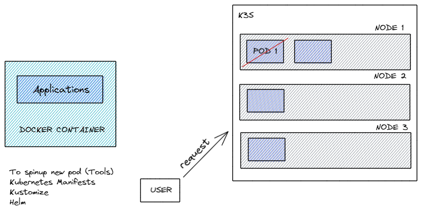
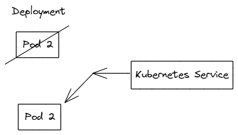
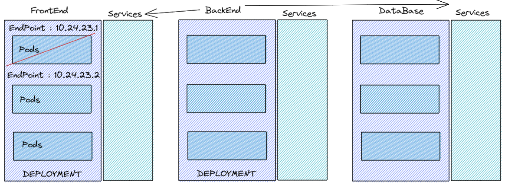
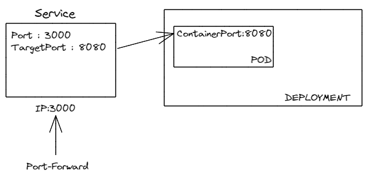
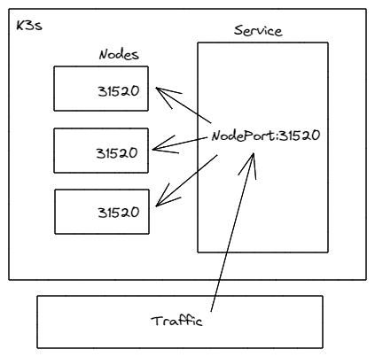
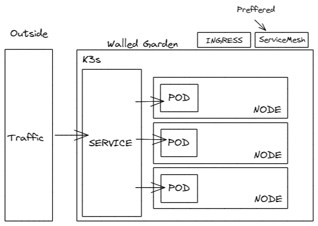

<h2 align="middle">KUBERNETES SERVICES</h2>

<h3>Introduction to Services</h3>

<h4>Let's spinup pod : </h4>

    kubectl get nodes
    kubectl get all 
    kubectl create ns [Namespace_Name]

    # Once the ns created, now we can deploy pod to ns

    kubectl apply -f [PodName] -n [Namespace_Name]
    kubectl get all -n [Namespace_Name]

    # To delete Pod

    kubectl delete pod [PodName] -n [Namespace_Name]

In Kubernetes we can use "reconsile"
To reconsile our resources. When our pod dies, we want a new pod spinup, So we use deployment.

    # To deploy deployment in namespace
    
    kubectl apply -f [Deployment_Name].yaml -n [Namespace_Name]

    # To see all information

    kubectl get all -n [Namespace_Name]

    # To delete Pod

    kubectl delete [Pod_Name] -n [Namespace_Name]

    When, we delete a existing pod, we see that a new pod created in place of deleted Pod.

    # To access specific pod

    kubectl port-forward [Pod_Name] -n [Namespace_Name] 8080:8080 <<- [PortNumber]

    Now, Open Browser and
    search "localhost:8080" <<-[PortNumber]

When we are doing Port-forwarding, if the pod dies the link here is gonna be broken, and I won't able to access this pod anymore. And this is when the Kubernetes services coming, the service instead of port-forwarding, we will deploy a Kubernetes service and the Kubernetes service will basically specify, now we can connect to our deployment in that case if one of this pod dies and a new pod is spinup, I will be automatically forward to the other pod. And that Pod dies it will spinup Pod1 , it will automatically back to other pod itself. If both Pod alive, it will routed to any of the pod or the pod have least traffic. 
So, a Kubernetes Service basically allows us to connect to navigate to different Pod.

Lets Assume, we have FrontEnd, BackEnd and DataBase, all have three Pods with different EndPoints, simultaneously. If any of the Pod from FrontEnd dies, it will automatically creates another Pod with different EndPoint. So, we cannot assign the BackEnd to directly talk with these EndPoint, because the EndPoints are always changes. Insteads we will spinup services between those different sections of our Applications. In this case the services assigned a specific EndPoint. So, we can tell the BackEnd this is the service, that always communicate to. And these service allows us to communicate with deployment that have Pod in it.

There are three different types of Kubernetes Services :
<ul>
<li>Cluster IP</li>
<li>NodePort</li>
<li>LoadBalancer</li>
<li>Headless Service</li>
</ul>

<h3>CLUSTER IP</h3>
- Default Service 
- Only accessable within the cluster
 

 

We want to connect service to pod, in this case we want to connect through Port:3000, If I Port-Forward to the service, first will be localhost and then 3000 in this case pod runs on ConatinerPort:8080, thats the port my application connect to. The targetPort has to be same as on ContainerPort. So, my localhost will conncet to ServicePort:3000 but the service knows that this is not the port that targeting, then it Port-Forward to ContainerPort:8080.

If we want to make accessable from the outside, then I will use "Ingress" that also has some different Port Rules. The Ingress which is accessable through people who are unknown such as uses of our web-applications.
<h3>INGRESS</h3>

Kubernetes Ingress is a collection of routing rules that govern how external user access services running in a Kubernetes Cluster. However, in real-world Kubernetes Deployment, there are frequently additional consideration beyond routing for ingress.

<h5>Ingress in Kubernetes:</h5>
There are three general approaches to exposing application -- 
- Using NodePort, which exposes the application on a port across each of nodes. 
- Using LoadBalancer, which creates an external load balancer that points to a Kubernetes service in cluster. 
<h3>NodePort</h3>

A NodePort is an open port on every node of your cluster. Kubernetes transparently routes incoming traffic on the NodePort to your service, even if your application is running a different node. However, a NodePort is assigned from a pool of cluster-configured NodePort ranges (typically from 30000 - 32767).
 

<h4>Headless Service</h4>

In Headless service, we will not specify any type of Port.

So summerising, 
Both NodePort and Headless service both allow us to setup moew customize some routing solutions to our service running within our Kubernetes Cluster.

<h3>LOADBALANCER</h3>

Using a LoadBalancer service type automatically deploys an external load balancer. This external load balancer is associated with a specific IP Address and routes external traffic to a Kubernetes service in your cluster.

